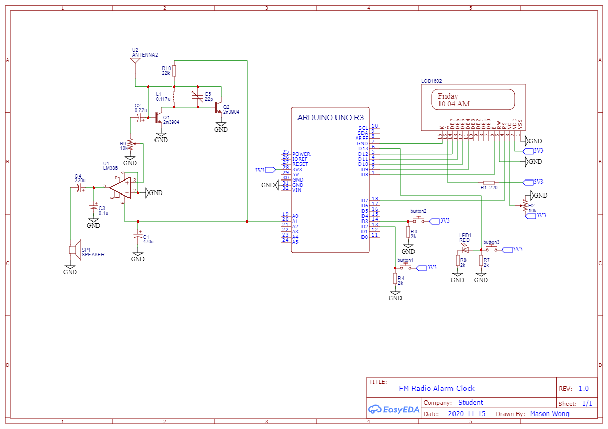

# FM Radio Alarm Clock 
This radio alarm clock was built over a couple of weeks with the use of an Arduino UNO R3, LCD1602, and various electronic components. 

# Circuit Schematic

# Components List
* 1 x Arduino UNO R3
* 1 x LCD1602
* 3 x Tactile Push Button
* 1 x Red LED
* 5 x 2kOhm Resistor
* 1 x 22kOhm Resistor
* 2 x 10kOhm Potentiometer
* 1 x 450uF Capacitor
* 1 x 220uF Capacitor
* 1 x 0.1uF Capacitor
* 1 x 0.22uF Capacitor
* 1 x 22pF Variable Capacitor
* 1 x 0.117uH Inductor (made with 24 Guage Magnetic Wire)
* 1 x LM386 Low Voltage Audio Power Amplifier
* 1 x 4Ohm 3W Audio Speaker
* 1 x Antenna
* 2 x 2n3904 NPN Transistor

# Required Software
To operate this project you will need to have the Arduino IDE so that you can upload the code to the Arduino UNO R3.
You can download this IDE for free at this link: https://www.arduino.cc/en/software

